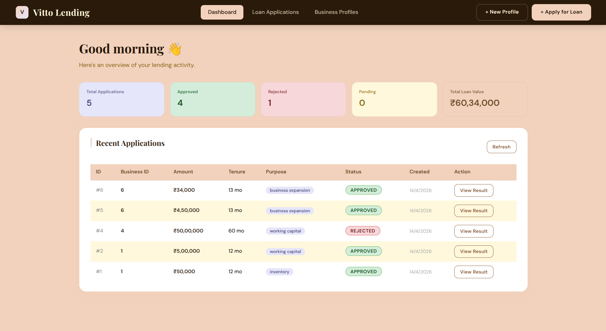
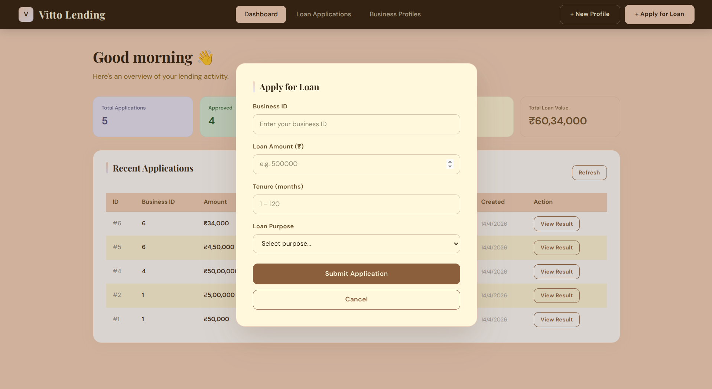
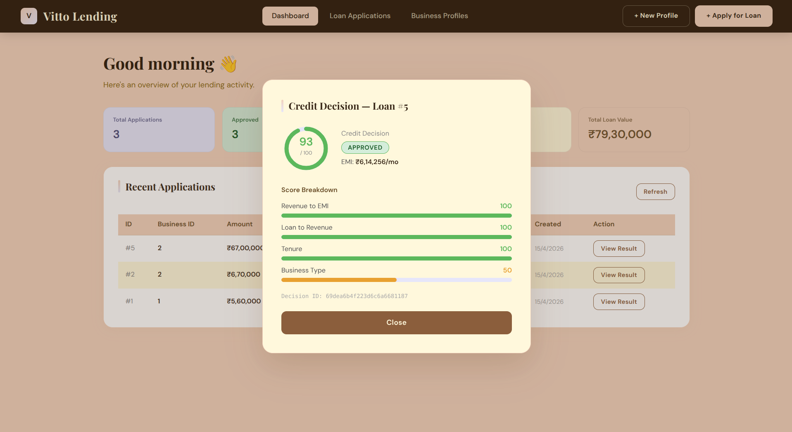

# 🏦 Vitto Lending — MSME Credit Decision Platform

> A production-grade, end-to-end lending decision system that accepts MSME business profiles and loan inputs, runs them through a custom credit decision engine, and surfaces a structured decision with reasoning.

<br/>

<!-- Replace the paths below with actual screenshots after deployment -->

> 📸 _Add your screenshots in a `/screenshots` folder at the root of the repo_

<br/>

## 📌 Table of Contents

- [Overview](#overview)
- [Tech Stack](#tech-stack)
- [Architecture](#architecture)
- [Features](#features)
- [Decision Logic](#decision-logic)
- [API Reference](#api-reference)
- [Edge Case Handling](#edge-case-handling)
- [Getting Started](#getting-started)
- [Docker Setup](#docker-setup)
- [Environment Variables](#environment-variables)
- [Project Structure](#project-structure)
- [Assumptions](#assumptions)

<br/>

---

## 🎯 Overview

Vitto Lending is a lightweight, full-stack MSME lending decision system built as a 1-day sprint. It simulates the core workflow of a digital lender:

1. A business owner submits their profile and loan requirements
2. The system validates all inputs and runs a multi-signal credit scoring engine
3. A structured decision (Approved/Rejected) is returned with a credit score, reason codes, and EMI breakdown
4. All decisions are persisted as an audit trail in MongoDB

The emphasis is on **clean architecture**, **real-world edge case handling**, and **defensible credit logic** — not feature volume.

<br/>

---

## 🛠 Tech Stack

| Layer | Technology |
|---|---|
| **Frontend** | React 18 + Vite |
| **Backend** | Node.js + Express |
| **Relational DB** | PostgreSQL 15 (businesses & loans) |
| **Document DB** | MongoDB 6 (decisions & audit trail) |
| **Reverse Proxy** | Nginx |
| **Containerization** | Docker + Docker Compose |
| **Deployment** | Self-hosted VPS with Nginx |

<br/>

---

## 🏗 Architecture

```
                        ┌─────────────────────────┐
                        │        Browser           │
                        │   resunexi.com (HTTPS)   │
                        └────────────┬─────────────┘
                                     │
                        ┌────────────▼─────────────┐
                        │          Nginx            │
                        │  :80 / :443 reverse proxy │
                        └──────┬──────────┬─────────┘
                               │          │
                   ┌───────────▼──┐  ┌────▼──────────────┐
                   │  React SPA   │  │  Node/Express API  │
                   │  (static)    │  │  :3000             │
                   └──────────────┘  └────┬──────────┬────┘
                                          │          │
                              ┌───────────▼─┐  ┌─────▼──────┐
                              │  PostgreSQL  │  │  MongoDB   │
                              │  businesses  │  │  decisions │
                              │  loans       │  │  audit log │
                              └─────────────┘  └────────────┘
```

**Why two databases?**

- **PostgreSQL** — relational, consistent storage for structured entities (businesses and loans) that have clear foreign key relationships
- **MongoDB** — document store for decision outputs, which are naturally unstructured (variable reason codes, nested score breakdowns, audit metadata)

<br/>

---

## ✨ Features

- ✅ Business profile creation with PAN validation
- ✅ Loan application submission with purpose categorisation
- ✅ Custom multi-signal credit scoring engine (fully documented)
- ✅ Binary decision: `APPROVED` / `REJECTED`
- ✅ Reason codes explaining every decision
- ✅ EMI computation displayed to the applicant
- ✅ Score breakdown (4 weighted signals)
- ✅ Full audit trail — every decision stored in MongoDB with timestamps
- ✅ Graceful error handling and structured error responses
- ✅ Dashboard with live stats (total, approved, rejected, pending, loan value)
- ✅ Dockerised local development and production deployment
- ✅ Nginx reverse proxy with HTTP → HTTPS redirect

<br/>

---

## 🧠 Decision Logic

The credit engine computes a **weighted score out of 100** using four independent signals. A score ≥ 60 results in `APPROVED`.

### Scoring Formula

```
FINAL SCORE = (S1 × 0.35) + (S2 × 0.30) + (S3 × 0.20) + (S4 × 0.15)
```

---

### Signal 1 — Revenue-to-EMI Ratio (Weight: 35%)

Checks whether the business can afford the monthly repayment. EMI is computed using a flat monthly interest rate of **1.5% (~18% annual)**.

```
EMI = (P × r) / (1 − (1 + r)^−n)
```

| Revenue / EMI Ratio | Score |
|---|---|
| ≥ 3× | 100 |
| ≥ 2× | 75 |
| ≥ 1.5× | 50 |
| ≥ 1× | 25 |
| < 1× | 0 |

**Rationale:** A business should comfortably generate at least 2–3× the EMI in monthly revenue. Below 1× means they cannot service the loan at all.

---

### Signal 2 — Loan-to-Revenue Multiple (Weight: 30%)

Checks whether the loan size is proportionate to business scale.

| Loan / Monthly Revenue | Score |
|---|---|
| ≤ 6 months | 100 |
| ≤ 12 months | 75 |
| ≤ 24 months | 50 |
| ≤ 36 months | 25 |
| > 36 months | 0 |

**Rationale:** Loan amounts beyond 24–36× monthly revenue signal overleverage and higher default probability.

---

### Signal 3 — Tenure Risk (Weight: 20%)

Very short tenures imply large EMIs (affordability risk); very long tenures imply extended exposure.

| Tenure Range | Score |
|---|---|
| 6 – 24 months | 100 |
| 3 – 36 months | 65 |
| 1 – 48 months | 30 |
| Outside range | 0 |

---

### Signal 4 — Business Type Risk (Weight: 15%)

Different business categories carry different historical default risk profiles.

| Business Type | Score |
|---|---|
| Services | 100 |
| Retail | 75 |
| Manufacturing | 60 |
| Construction | 40 |
| Other / Unknown | 50 |

---

### Reason Codes

Reason codes are generated independently of the score — a loan can be approved but still carry informational reason codes.

| Code | Condition |
|---|---|
| `LOW_REVENUE_TO_EMI` | Revenue/EMI ratio < 1.5 |
| `HIGH_LOAN_RATIO` | Loan > 24× monthly revenue |
| `UNUSUAL_TENURE` | Tenure < 3 or > 48 months |
| `DATA_INCONSISTENCY` | Loan > 50× monthly revenue |
| `INVALID_PAN_FORMAT` | PAN fails regex `^[A-Z]{5}[0-9]{4}[A-Z]{1}$` |
| `LOW_CREDIT_SCORE` | Fallback on rejection with no other codes |

<br/>

---

## 📡 API Reference

**Base URL:** `https://resunexi.com/api` (production) or `http://localhost:3000/api` (local)

All responses follow this envelope:
```json
{ "success": true, "data": { ... } }
{ "success": false, "errors": [{ "field": "pan", "message": "Invalid PAN format" }] }
```

---

### Business Profiles

#### `POST /api/profile` — Create Business Profile

**Request Body:**
```json
{
  "owner_name": "Rahul Sharma",
  "pan": "ABCDE1234F",
  "business_type": "retail",
  "monthly_revenue": 150000
}
```

**Response `201`:**
```json
{
  "success": true,
  "data": {
    "id": 1,
    "owner_name": "Rahul Sharma",
    "pan": "ABCDE1234F",
    "business_type": "retail",
    "monthly_revenue": "150000.00",
    "created_at": "2025-01-15T10:30:00.000Z"
  }
}
```

---

#### `GET /api/profile/:id` — Get Business Profile

**Response `200`:**
```json
{
  "success": true,
  "data": { "id": 1, "owner_name": "Rahul Sharma", ... }
}
```

---

### Loan Applications

#### `POST /api/loan` — Submit Loan Application

**Request Body:**
```json
{
  "business_id": 1,
  "requested_amount": 500000,
  "tenure_months": 12,
  "purpose": "working_capital"
}
```

Valid purposes: `business_expansion`, `inventory`, `equipment`, `working_capital`, `personal`

**Response `201`:**
```json
{
  "success": true,
  "data": {
    "id": 1,
    "business_id": 1,
    "requested_amount": "500000.00",
    "tenure_months": 12,
    "purpose": "working_capital",
    "status": "pending",
    "created_at": "2025-01-15T10:31:00.000Z"
  }
}
```

---

#### `GET /api/loan` — List All Loan Applications

**Response `200`:**
```json
{
  "success": true,
  "data": [ { "id": 1, ... }, { "id": 2, ... } ]
}
```

---

### Decision Engine

#### `POST /api/decisions/:loan_id` — Run Credit Decision

Fetches loan + business data from PostgreSQL, runs the scoring engine, stores result in MongoDB, and updates loan status.

**Response `200`:**
```json
{
  "loan_id": 1,
  "business_id": 1,
  "decision": "APPROVED",
  "credit_score": 86,
  "reason_codes": [],
  "emi_computed": 45840,
  "breakdown": {
    "revenue_to_emi_score": 100,
    "loan_to_revenue_score": 100,
    "tenure_score": 100,
    "business_type_score": 75
  },
  "decision_id": "64f1a2b3c4d5e6f7a8b9c0d1"
}
```

---

#### `GET /api/decisions/:loan_id` — Fetch Past Decision (Audit Trail)

Retrieves the stored decision document from MongoDB.

**Response `200`:**
```json
{
  "_id": "64f1a2b3c4d5e6f7a8b9c0d1",
  "loan_id": 1,
  "business_id": 1,
  "decision": "APPROVED",
  "credit_score": 86,
  "reason_codes": [],
  "emi_computed": 45840,
  "breakdown": { ... },
  "created_at": "2025-01-15T10:32:00.000Z"
}
```

---

#### `GET /` — Health Check

```json
{ "status": "ok", "message": "Vitto Lending API is running" }
```

<br/>

---

## ⚠️ Edge Case Handling

| Input Scenario | Handling |
|---|---|
| Missing required fields | `400` with field-level error array |
| Negative revenue or loan amount | Rejected with `INVALID_REVENUE` |
| Non-numeric values | Validation middleware returns `400` |
| Malformed PAN (e.g. `ABC123`) | `INVALID_PAN_FORMAT` reason code |
| Duplicate PAN | PostgreSQL UNIQUE constraint → `409` |
| Loan > 50× monthly revenue | `DATA_INCONSISTENCY` reason code |
| Tenure < 1 or > 120 months | `UNUSUAL_TENURE` reason code |
| Non-existent business_id on loan | `404 Business not found` |
| Running decision twice on same loan | Returns existing decision from MongoDB |
| Server errors | Global error handler → `500` with structured JSON (never HTML) |

<br/>

---

## 🚀 Getting Started

### Prerequisites

- [Docker](https://docs.docker.com/get-docker/) and Docker Compose v2
- Git

### 1. Clone the Repository

```bash
git clone git@github.com:ricky08sirus/vitto-lender.git
cd vitto-lender
```

### 2. Set Up Environment Variables

```bash
cp backend/.env.example backend/.env
```

Edit `backend/.env` with your values (see [Environment Variables](#environment-variables) below).

### 3. Start with Docker

```bash
docker compose up --build
```

This starts:
- **PostgreSQL** on port `5432`
- **MongoDB** on port `27017`
- **Backend API** on port `3000`
- **Frontend + Nginx** on port `80`

Visit: [http://localhost](http://localhost)

### 4. Running Locally Without Docker (Development)

**Backend:**
```bash
cd backend
npm install
npm run dev       # uses nodemon if configured, else: node index.js
```

**Frontend:**
```bash
cd frontend
npm install
npm run dev       # Vite dev server at http://localhost:5173
```

<br/>

---

## 🐳 Docker Setup

The project includes a full Docker Compose configuration for both local development and production.

```bash
# Build and start all services
docker compose up --build

# Start in background
docker compose up -d --build

# Stop all services
docker compose down

# Rebuild a single service (e.g. after frontend changes)
docker compose up -d --build nginx

# View logs
docker compose logs -f backend
docker compose logs -f nginx

# Reset all data (drops volumes)
docker compose down -v
```

### Services

| Service | Image | Port |
|---|---|---|
| `backend` | Custom Node.js build | `3000` |
| `postgres` | `postgres:15-alpine` | `5432` |
| `mongo` | `mongo:6` | `27017` |
| `nginx` | Custom React + Nginx build | `80`, `443` |

<br/>

---

## 🔐 Environment Variables

Create `backend/.env` with the following:

```env
# Server
PORT=3000

# PostgreSQL
POSTGRES_HOST=postgres
POSTGRES_PORT=5432
POSTGRES_USER=vitto
POSTGRES_PASSWORD=vitto123
POSTGRES_DB=vitto_lending

# MongoDB
MONGO_URI=mongodb://mongo:27017/vitto_lending
```

> **Note:** For local development without Docker, change `POSTGRES_HOST` to `localhost` and `MONGO_URI` to `mongodb://localhost:27017/vitto_lending`.

<br/>

---

## 📁 Project Structure

```
vitto-lender/
├── backend/
│   ├── src/
│   │   ├── config/
│   │   │   ├── mongo.js          # MongoDB connection
│   │   │   ├── postgres.js       # PostgreSQL pool
│   │   │   └── initDB.js         # Table creation on startup
│   │   ├── engine/
│   │   │   └── creditEngine.js   # Core scoring logic (pure function)
│   │   ├── models/
│   │   │   └── Decision.js       # Mongoose schema for decisions
│   │   └── routes/
│   │       ├── profile.js        # POST /api/profile, GET /api/profile/:id
│   │       ├── loan.js           # POST /api/loan, GET /api/loan
│   │       └── decision.js       # POST/GET /api/decisions/:loan_id
│   ├── index.js                  # Express app entry point
│   ├── .env                      # Environment variables (not committed)
│   └── Dockerfile
├── frontend/
│   ├── src/
│   │   ├── App.jsx               # Single-file React SPA
│   │   └── main.jsx
│   ├── public/
│   │   └── favicon.ico
│   ├── index.html
│   └── Dockerfile
├── nginx/
│   └── nginx.conf                # Reverse proxy config
├── screenshots/                  # Add your screenshots here
│   ├── dashboard.png
│   ├── loan-form.png
│   └── decision-result.png
└── docker-compose.yml
```

<br/>

---

## 📝 Assumptions

1. **Interest Rate** — A flat monthly rate of 1.5% (~18% annual) is used for EMI computation. This is a common benchmark for MSME lending in India and produces defensible affordability thresholds.

2. **PAN Validation** — The Indian PAN format `AAAAA0000A` (5 letters, 4 digits, 1 letter) is enforced via regex. This is a mock check; real systems would verify against NSDL.

3. **Approval Threshold** — A credit score ≥ 60/100 results in approval. This threshold balances inclusion (not too restrictive) with risk management (filters out clearly high-risk applicants).

4. **Business Type Scores** — Risk weights are based on general industry knowledge of MSME default rates in India. Services businesses tend to have lower overhead and more predictable cash flows than construction.

5. **Tenure Bounds** — Tenures below 3 months or above 48 months are flagged as unusual. Below 3 months implies extremely high EMI burden; above 48 months indicates long-term unsecured exposure uncommon in MSME lending.

6. **Idempotent Decisions** — Running the decision engine on a loan that already has a decision returns the stored result rather than re-computing, preserving audit integrity.

7. **Single Decision per Loan** — Each loan gets exactly one decision. Re-running is blocked once a decision exists in MongoDB.

8. **Currency** — All monetary values are in Indian Rupees (₹). Revenue and loan amounts are stored as `NUMERIC(15,2)` in PostgreSQL.

<br/>

---

## 📸 Screenshots

> Add screenshots to the `/screenshots` directory and update the paths below.

| Dashboard | Loan Application | Credit Decision |
|---|---|---|
|  |  |  |

<br/>

---

## 🌐 Live Demo

**Frontend:** [https://resunexi.com](https://resunexi.com)  
**API Health:** [https://resunexi.com/api](https://resunexi.com/api)

<br/>

---

## 📬 Contact

Built as a confidential technical assessment for **Vitto**.  
For questions, reach out to your recruiting contact.

---

<div align="center">
  <sub>Built with ☕ and clean architecture in mind.</sub>
</div>
